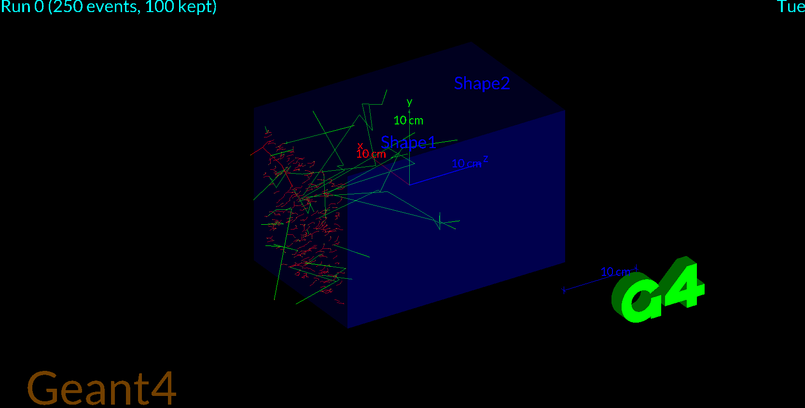

## 2026-07-07

**Worked on:** - Katz-Penfold Calculations
- Calculated the range of electron's at 2.28 MeV to be ~1.1 cm
- See working in \analysis\katz-penfold.ipynb

**Worked on:** - Setting up a new Geant4 Simulation
- Experimented with different energies for particles
- Swapped between gamma rays and electrons
- Bug: had to fix particle name "electron" → "e-" (Geant4 uses e-)

**Worked on:** - Geant4 electron energy sweep
- Fired electrons at 0.3, 1.0, 2.28 MeV into water geometry
- Confirmed range grows with energy; 2.28 MeV stops ~1.1 cm deep
- This matches my hand-calc (Katz-Penfold) and validates the risk assessment

- Data from experiment:
- [
    G4WT0 > New max depth: 0.832747 cm
    G4WT6 > New max depth: 0.932728 cm
    G4WT3 > New max depth: 0.922844 cm
    G4WT5 > New max depth: 0.355193 cm
    G4WT5 > New max depth: 0.55975 cm
    G4WT5 > New max depth: 0.681704 cm
    G4WT5 > New max depth: 0.720043 cm
    G4WT5 > New max depth: 0.772264 cm
    G4WT0 > New max depth: 0.845974 cm
    G4WT5 > New max depth: 0.778703 cm
    G4WT4 > New max depth: 0.974149 cm
    G4WT1 > New max depth: 1.00632 cm
    G4WT2 > New max depth: 0.984367 cm
    G4WT3 > New max depth: 0.960228 cm
    G4WT0 > New max depth: 0.966079 cm
    G4WT5 > New max depth: 0.823485 cm
    G4WT2 > New max depth: 0.98717 cm
    G4WT3 > New max depth: 0.960228 cm
    G4WT0 > New max depth: 0.979311 cm
    G4WT5 > New max depth: 0.941666 cm
    G4WT0 > New max depth: 0.979484 cm
    G4WT5 > New max depth: 1.01224 cm
    G4WT5 > New max depth: 1.06413 cm
    G4WT5 > New max depth: 1.06997 cm
]
- ~1.07 cm, in agreement with ~1.1 cm ±5-10%